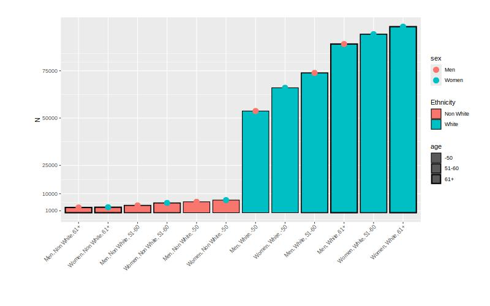

# Create stratas 

```{r load_data, message=FALSE, warning=FALSE, include=FALSE}

rm(list = ls())
graphics.off()
set.seed(25032024)

library(tidyverse)
library(ggeffects)   # predictions and significance testing
library(insight)     # extracting random effects variances
library(datawizard)  # data wrangling and preparation
library(parameters)  # model summaries
library(performance) # model fit indices, ICC
library(glmmTMB)     # multilevel modelling
library(sjPlot)

full_data <- readRDS("../../data/alldata2_toplay")

mydata <- full_data %>% select(
  Age = Demo_Age_Num,
  Sex = Demo_Sex_Bin_Men,
  Ethnicity = Demo_Ethnic_Bin_White,
  AgeEducEnd = SocioEco_Educ_AgeEnd_Num,
  Qualification = SocioEco_Educ_QualifLev_Cat_Low,
  Qualif_med = SocioEco_Educ_QualifLev_Cat_Medium,
  Urban = Env_RuralOrUrban_Urban,
  AirPoll_PM10 = Env_AirPoll_PM10_ugm3,
  Loneliness = SocioEco_Social_Loneliness_Bin_Yes)

rm(full_data)

```

## Choose variables

For the first example, we use real data from the UKBB.

This is an exploratory and not a confirmatory analysis, the results are purely didactic and cannot be really interpreted. In particular, for simplicity, a simple imputation of missing data (KNN) has been carried out, which may affect the results.

### A first simple exemple (12 strata)
To define strata, we choose the following variables: 

- age, by classes "-50", "51-60", "61+"
- declared binary sex category (men or women), 
- ethnicity (white or non-white). 

Outcomes will be 4th later intersectional categories describing cultural/intellectual ressources, i.e. 

- either age at the end of education (quantitative variables) 
- or level of qualification (binary variable).

There are no variables characterizing socio-economic position at the start of life in this dataset, such as parent social class or income. 

### A second exemple (48 strata)

In a second step, we use to define intersectional strata:

- age, by classes "-50", "51-60", "61+"
- declared binary sex category (men or women), 
- ethnicity (white or non-white)
- level of qualification (medium/high, low)
- and life place (rural, urban)

The outcomes were: 

- feeling lonely (binary outcomes)
- exposition to air pollution (pm10, ugm3).


## Definition and description

```{r labels}
mydata$Sex <- factor(round(mydata$Sex),
                           labels = c("Women","Men"))

mydata$Ethnicity <- factor(round(mydata$Ethnicity),
                           label = c("Non White","White"))

mydata <- mydata %>% 
  # recode age into three groups
  mutate(Age_class = round(Age)) %>% 
  recode_values(
    select = "Age_class",
    recode = list(`1` = "min:50", `2` = 51:60, `3` = "61:max")) %>% 
  mutate(Age_class = factor(Age_class, labels = c("-50", "51-60", "61+")))

mydata$Qualification <- factor(round(mydata$Qualification),
                               labels = c("Med-High Qualif.", "Low Qualif."))

mydata$Urban <- factor(round(mydata$Urban),
                       labels = c("Rural", "Urban"))

mydata$Loneliness <- factor(round(mydata$Loneliness),
                       labels = c("No", "Yes"))

table1::table1(~ Sex + Age + Ethnicity + AgeEducEnd + Qualification + Urban + Loneliness + AirPoll_PM10,
       data=mydata,
    overall=c(left="Total"),
    caption="Description")

```

## Create strata variables

### For the first exemple (12 strata)

To create the stratas, I use the method describe in the vignette in the [ggeffects]:https://strengejacke.github.io/ggeffects/articles/practical_intersectionality.html package.

This involves concatenating the labels of the different variables. 

Remember to name the variable in the label, for example Ethnicity[White;Non White] rather than White[Yes;No].

```{r strata_1}
mydata$strata <- ifelse(
  is.na(mydata$Sex) | is.na(mydata$Ethnicity) | is.na(mydata$Age_class),
  NA_character_,
  paste0(mydata$Sex, ", ", mydata$Ethnicity, ", ", mydata$Age_class)
)

mydata$strata <- factor(mydata$strata)
```

We have 12 stratas

```{r descr_strata_1}

# data_tabulate(mydata$strata)

table1::table1(~ strata,
       data=mydata,
    overall=c(left="Total"),
    caption="Stratas (12)")

```

### For the second exemple (48 strata)

And with more categories:

```{r strata_2 }
mydata$strata_2 <- ifelse(
  is.na(mydata$Sex) | is.na(mydata$Ethnicity) | 
    is.na(mydata$Age_class) | is.na(mydata$Qualification) | is.na(mydata$Urban),
  NA_character_,
  paste0(mydata$Sex, ", ", mydata$Ethnicity, ", ",
         mydata$Age_class,", ", mydata$Qualification,", ", mydata$Urban)
)
```

We have 48 stratas

```{r descr_strata_2}

mydata$strata_2 <- factor(mydata$strata_2)

table1::table1(~ strata_2,
       data=mydata,
    overall=c(left="Total"),
    caption="Stratas (48)")

```

In this case, some stratas are very small.

```{r sizr_1, message=FALSE, warning=FALSE}
tab <- data_tabulate(mydata$strata_2)
tab <- tab[1:48,]
min(tab$N)
max(tab$N)

```

## Plots the stratas distribution

### For the first exemple

```{r plot_stata_1, message=FALSE, warning=FALSE}

df <- data.frame(x = names(table(mydata$strata)),
                 p = as.numeric(table(mydata$strata))/length(mydata$strata),
                 n = as.numeric(table(mydata$strata)))

df$sex = as.factor(ifelse(grepl("Men", df$x), "Men", "Women"))
df$ethnicity <- as.factor(ifelse(grepl("Non White", df$x), "Non White", "White"))
df$age <- as.factor(ifelse(grepl("61+", df$x), "61+",
                           ifelse(grepl("-50", df$x), "-50","51-60")))

jpeg("img/plot_stata_1.jpeg",
         width = 800, height = "500")
ggplot(data = df) + 
  geom_col(aes(x = fct_reorder(x,n,.fun='median'), y = n,
               linewidth = age,  fill = ethnicity), color = "black") +
  geom_point(aes(x = fct_reorder(x,n,.fun='median'), y = n,
                 color = sex), size =4) +
  theme(plot.margin = margin(1,1,1.5,2, "cm"))+ 
  labs (x="", y = "N",
        fill = "Ethnicity") +
  theme(axis.text.x = element_text(angle = 45,  vjust=1,  hjust=1))+
  scale_linewidth_discrete(range = c(0.5, 1))+
  # scale_y_log10()
  scale_y_continuous(breaks = c(1000, 10000, 25000,50000, 75000))+
  scale_shape_manual(values=c(19, 15))
dev.off()


```



### For the second exemple

```{r stata_2, fig.asp = 0.8, fig.width = 10, message=FALSE, warning=FALSE}

df_2 <- data.frame(x = names(table(mydata$strata_2)),
                 p = as.numeric(table(mydata$strata_2))/length(mydata$strata_2),
                 n = as.numeric(table(mydata$strata_2)))
df_2$sex = as.factor(ifelse(grepl("Men", df_2$x), "Men", "Women"))
df_2$ethnicity <- as.factor(ifelse(grepl("Non White", df_2$x), "Non White", "White"))
df_2$age <- as.factor(ifelse(grepl("61+", df_2$x), "61+",
                           ifelse(grepl("-50", df_2$x), "-50","51-60")))
df_2$qualification <- as.factor(ifelse(grepl("Low", df_2$x), "Low", "Med-High"))
df_2$LocalArea <- as.factor(ifelse(grepl("Urban", df_2$x), "Urban", "Rural"))

jpeg("img/plot_stata_2.jpeg",
         width = 1200, height = "800")
ggplot(data = df_2) + 
  geom_col(aes(x = fct_reorder(x,n,.fun='median'), y = n,
               linewidth = age,  fill = ethnicity, alpha = LocalArea), color = "black") +
  geom_point(aes(x = fct_reorder(x,n,.fun='median'), y = n,
                 shape = qualification,  color = sex), size =4) +
  theme(plot.margin = margin(1,1,1.5,2, "cm"))+ 
  labs (x="", y = "N",
        fill = "Ethnicity") +
  theme(axis.text.x = element_text(angle = 45,  vjust=1,  hjust=1))+
  scale_alpha_discrete(range = c(0.5, 1))+
  scale_linewidth_discrete(range = c(0.5, 1))+
  # scale_y_log10()
  scale_y_continuous(breaks = c(1000, 10000, 20000,30000,40000,50000))+
  scale_shape_manual(values=c(19, 15))

dev.off()


```


