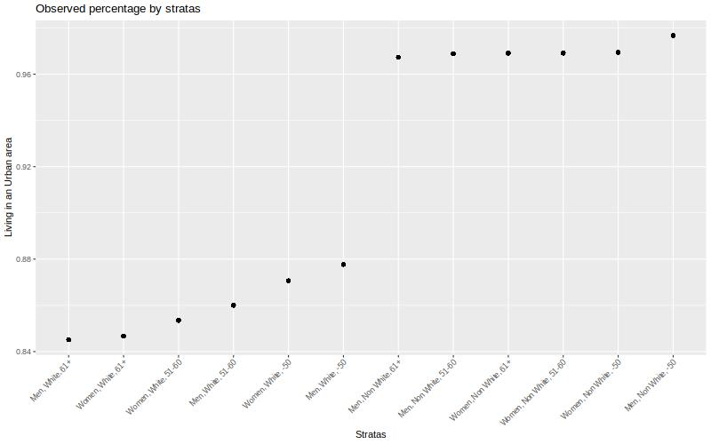
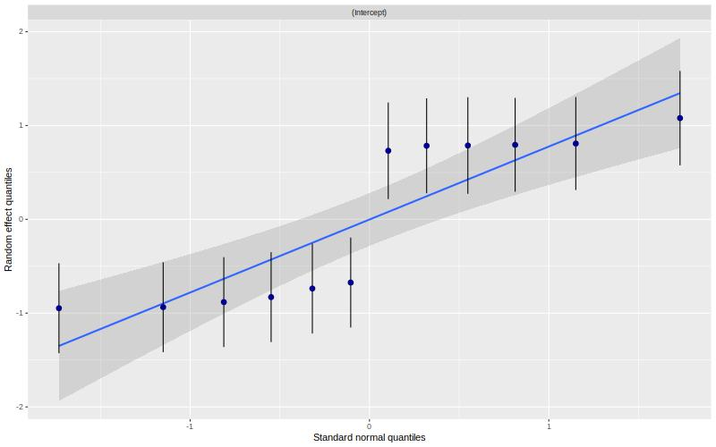
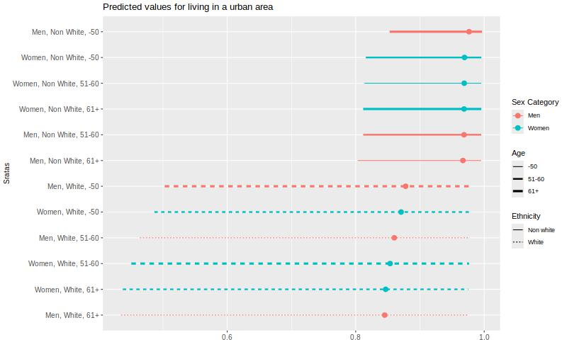

# Simple example - binary outcome

As a working example, we want to explore intersectional inequalities in life place (a "late" intersectional strata) by early intersectional strata (12 stratas).


## Description

We can start by describe the outcome by strata.

```{r message=FALSE, warning=FALSE}

table1::table1(~ Sex + Age_class + Ethnicity | Urban,
       data=mydata,
    overall=c(left="Total"),
    caption="Description by life place")

```

We can plot the observed probability.

```{r plot_12_quali}
jpeg("img/plot_12_quali.jpeg",
         width = 800, height = "500")
mydata %>% 
  group_by(strata) %>% 
  mutate(tot = n()) %>% ungroup() %>% 
  group_by(strata,Urban) %>% 
  mutate(value = n()/tot) %>% 
  filter(Urban == "Urban") %>% 
  ggplot(aes(x = fct_reorder(strata,value,.fun='median'),
             y =value)) +
    geom_point()  +
    labs(x = "Stratas", y = "Living in an Urban area",
         title = "Observed percentage by stratas") +
  theme(axis.text.x = element_text(angle = 45,  vjust=1,  hjust=1))
dev.off()

```



## The null model (only strata) 

The null model allows us to estimate the IntraClass correlation (ICC), also known as the Variance Partition Coefficient (VPC), that is the part of the outcome variance that can be explained by the strata.


```{r models_1,  message=FALSE, warning=FALSE}

# multilevel model
m_null <- glmmTMB(Urban ~ 1 + (1 | strata),
                  data = mydata,
                  family = binomial)

# intercept varies according to the stratum
jpeg("img/models_1.jpeg",
         width = 800, height = "500")
sjPlot::plot_model(m_null, type = "diag")
dev.off()


```


Outputs of the models: 

```{r output 1, message=FALSE, warning=FALSE}
summary(m_null)

# get the variances:
v_null <- get_variance(m_null)
# between stratas variance:
v_null$var.random
# intraclass correlation 
ICC_intersect <- round(icc(m_null)$ICC_unadjusted*100, 2)
ICC_intersect

```

Plot of the predicted values by strata:

```{r plot 1, message=FALSE, warning=FALSE}
#plot
predictions <- predict_response(
      m_null,
      c("strata"),
      type = "random") 
    predictions <- predictions %>% 
      arrange(predicted) 
    predictions$rown = rownames(predictions)
    predictions$x_lab <- paste0(predictions$rown,".",predictions$x)
    predictions$sex <- as.factor(ifelse(grepl("Men", predictions$x), "Men", "Women"))
    predictions$ethnicity <- as.factor(ifelse(grepl("Non White", predictions$x), "Non white", "White"))
    predictions$age <- as.factor(ifelse(grepl("61+", df$x), "61+",
                           ifelse(grepl("-50", df$x), "-50","51-60")))
    jpeg("img/plot.jpeg",
         width = 800, height = "500")
    print(predictions %>% 
            ggplot(aes(x=predicted, y=fct_reorder(x,predicted,.fun='median'),
                       color = sex, linetype = ethnicity))+
            geom_point(size=3) +
            geom_linerange(aes(xmin = conf.low, xmax = conf.high, size = age))+
            labs( y = "Sratas", 
                  x = "",
                  color = "Sex Category",
                  linetype = "Ethnicity",
                  size = "Age",
                  title = paste("Predicted values for having a low Urban"))+
            theme(axis.title = element_text(size = 10),
                  axis.text=element_text(size=10)))+ 
            scale_size_discrete(range = c(0.5, 1.5))
dev.off()

```



## The variance change 

To calculate the (additive) contribution of each category to the total variance, we can estimate the variance change when adjusting for this category. The Proportional Variance Change (PVC) when adjusting for all categories is the portion of ICC/VPC explained by additive effect. Therefore 100% - PVC is the part explained by an intersectional effect .


```{r outputs 2,  message=FALSE, warning=FALSE}

# models where we add each category one by one
m_gender <- glmmTMB(Urban ~ Sex + (1 | strata), data = mydata, family=binomial)
m_ethnicity <- glmmTMB(Urban ~ Ethnicity + (1 | strata), data = mydata, family=binomial)
m_age <- glmmTMB(Urban ~ Age_class + (1 | strata), data = mydata, family=binomial)
m_full <- glmmTMB(Urban ~ Age_class + Ethnicity + Sex + (1 | strata), data = mydata, family=binomial)

v_gender <- get_variance(m_gender)
v_ethnicity <- get_variance(m_ethnicity)
v_age <- get_variance(m_age)
v_full <- get_variance(m_full)

prop_gender <- round(((v_null$var.random - v_gender$var.random) / v_null$var.random)*100,2)
prop_gender <- ifelse(is.null(prop_gender), 0, prop_gender)

prop_ethnicity <- round(((v_null$var.random - v_ethnicity$var.random) / v_null$var.random)*100,2)
prop_ethnicity <- ifelse(is.null(prop_ethnicity), 0, prop_ethnicity)

prop_age <- round(((v_null$var.random - v_age$var.random) / v_null$var.random)*100,2)
prop_age <- ifelse(is.null(prop_age), 0, prop_age)

prop_full <- round(((v_null$var.random - v_full$var.random) / v_null$var.random)*100,2)
prop_full <- ifelse(is.null(prop_full), 100, prop_full)
prop_intersection <- round(100 - prop_full,2)


print(
  as.data.frame(
    cbind(
    parameters = c("ICC/VPC", "% Sex category", "% Age/generation", "% Ethnicity", "%Intersection"),
    values = c(ICC_intersect,prop_gender, prop_age, prop_ethnicity,prop_intersection )
  )))

```

ICC is `r ICC_intersect`%, which is high. These differences is almost totally explained by ethnicity (`r prop_ethnicity`%).


