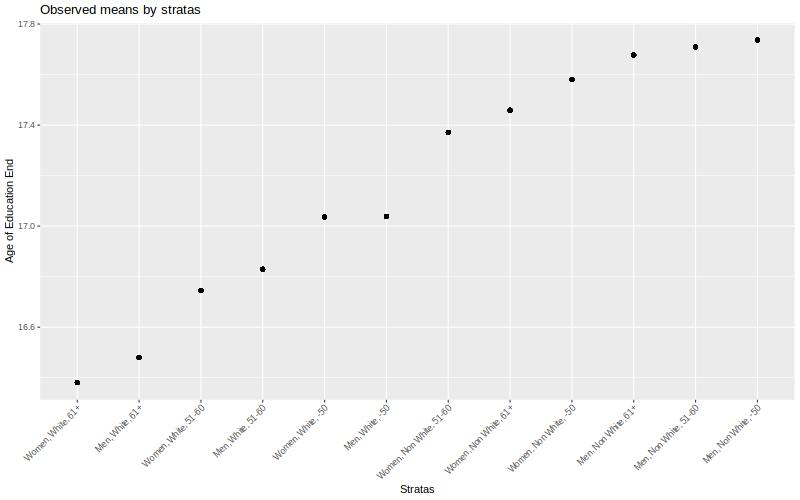
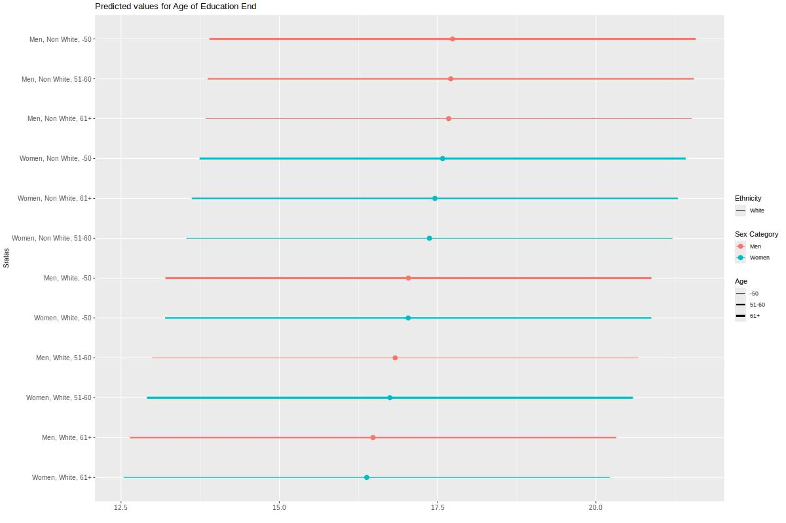

# Simple example - continous outcome

As a working example, we want to explore intersectional inequalities in educaion length (a "late" intersectional strata) by early intersectional strata (12 stratas).

## Description

```{r, message=FALSE, warning=FALSE}

mydata$AgeEducEnd_class <- as.factor(ifelse(mydata$AgeEducEnd < mean(mydata$AgeEducEnd),
                                                                     "Below mean", "Above mean"))
table1::table1(~ Sex + Age_class + Ethnicity | AgeEducEnd_class,
       data=mydata,
    overall=c(left="Total"),
    caption="Description by age of education end")

```

We can plot the observed probability.

```{r plot_12_quanti}
jpeg("img/plot_12_quanti.jpeg",
         width = 1200, height = "800")
mydata %>% 
  group_by(strata) %>% 
  mutate(value = mean(AgeEducEnd)) %>% 
  ggplot(aes(x = fct_reorder(strata,value,.fun='median'),
             y =value)) +
    geom_point()  +
    labs(x = "Stratas", y = "Age of Education End",
         title = "Observed mean by stratas") +
  theme(axis.text.x = element_text(angle = 45,  vjust=1,  hjust=1))
dev.off()

```



## The null model (only strata) 

The null model allows us to estimate the IntraClass correlation (ICC), also known as the Variance Partition Coefficient (VPC), that is the part of the outcome variance that can be explained by the strata.


```{r models_1_quanti,  message=FALSE, warning=FALSE}

# multilevel model
m_null <- glmmTMB(AgeEducEnd ~ 1 + (1 | strata),
                  data = mydata)


```

Outputs of the models: 

```{r output_1_quanti, message=FALSE, warning=FALSE}
summary(m_null)

# get the variances:
v_null <- get_variance(m_null)
# between stratas variance:
v_null$var.random
# intraclass correlation 
ICC_intersect <- round(icc(m_null)$ICC_unadjusted*100, 2)
ICC_intersect

```

Plot of the predicted values by strata:

```{r plot_1_quanti, message=FALSE, warning=FALSE}
#plot
predictions <- predict_response(
      m_null,
      c("strata"),
      type = "random") 
    predictions <- predictions %>% 
      arrange(predicted) 
    predictions$rown = rownames(predictions)
    predictions$x_lab <- paste0(predictions$rown,".",predictions$x)
    predictions$sex <- as.factor(ifelse(grepl("Men", predictions$x), "Men", "Women"))
    predictions$ethnicity <- as.factor(ifelse(grepl("Non white", predictions$x), "Non white", "White"))
    predictions$age <- as.factor(ifelse(grepl("61+", df$x), "61+",
                           ifelse(grepl("-50", df$x), "-50","51-60")))
    jpeg("img/plot_quanti.jpeg",
         width = 1200, height = "800")
    print(predictions %>% 
            ggplot(aes(x=predicted, y=fct_reorder(x,predicted,.fun='median'),
                       color = sex, linetype = ethnicity))+
            geom_point(size=3) +
            geom_linerange(aes(xmin = conf.low, xmax = conf.high, size = age))+
            labs( y = "Sratas", 
                  x = "",
                  color = "Sex Category",
                  linetype = "Ethnicity",
                  size = "Age",
                  title = paste("Predicted values for Age of Education End"))+
            theme(axis.title = element_text(size = 10),
                  axis.text=element_text(size=10)))+ 
            scale_size_discrete(range = c(0.5, 1.5))
dev.off()

```



## The variance change 

To calculate the (additive) contribution of each category to the total variance, we can estimate the variance change when adjusting for this category. The Proportional Variance Change (PVC) when adjusting for all categories is the portion of ICC/VPC explained by additive effect. Therefore 100% - PVC is the part explained by an intersectional effect .


```{r outputs_2_quanti,  message=FALSE, warning=FALSE}

# models where we add each category one by one
m_gender <- glmmTMB(AgeEducEnd ~ Sex + (1 | strata), data = mydata)
m_ethnicity <- glmmTMB(AgeEducEnd ~ Ethnicity + (1 | strata), data = mydata)
m_age <- glmmTMB(AgeEducEnd ~ Age_class + (1 | strata), data = mydata)
m_full <- glmmTMB(AgeEducEnd ~ Age_class + Ethnicity + Sex + (1 | strata), data = mydata)

v_gender <- get_variance(m_gender)
v_ethnicity <- get_variance(m_ethnicity)
v_age <- get_variance(m_age)
v_full <- get_variance(m_full)

prop_gender <- round(((v_null$var.random - v_gender$var.random) / v_null$var.random)*100,2)
prop_gender <- ifelse(is.null(prop_gender), 0, prop_gender)

prop_ethnicity <- round(((v_null$var.random - v_ethnicity$var.random) / v_null$var.random)*100,2)
prop_ethnicity <- ifelse(is.null(prop_ethnicity), 0, prop_ethnicity)

prop_age <- round(((v_null$var.random - v_age$var.random) / v_null$var.random)*100,2)
prop_age <- ifelse(is.null(prop_age), 0, prop_age)

prop_full <- round(((v_null$var.random - v_full$var.random) / v_null$var.random)*100,2)
prop_full <- ifelse(is.null(prop_full), 100, prop_full)
prop_intersection <- round(100 - prop_full,2)


print(
  as.data.frame(
    cbind(
    parameters = c("ICC/VPC", "% Sex category", "% Age/generation", "% Ethnicity", "%Intersection"),
    values = c(ICC_intersect,prop_gender, prop_age, prop_ethnicity,prop_intersection )
  )))

```

ICC is `r ICC_intersect`%, which is moderate. This differences is mainly explained by ethnicity (`r prop_ethnicity`%), age (`r prop_age`%) and an intersectional effect  (`r prop_intersection`%).


