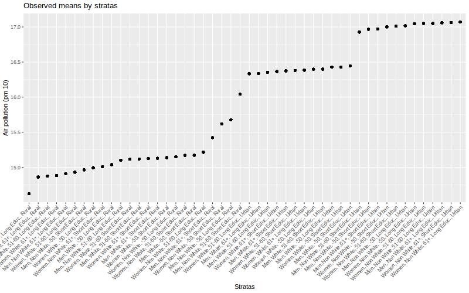

# More complexe example - quantitative outcome

As a working example, we want to explore intersectional inequalities in air pollution exposition by  intersectional strata (48 stratas).

## Description

We can start by describe the outcome by strata.


```{r  ,echo=F,  results='asis' , message = FALSE, warning=FALSE,  fig.pos = "H" }

mydata$AirPoll_PM10d_class <- as.factor(ifelse(mydata$AirPoll_PM10 < mean(mydata$AirPoll_PM10),
                                                                     "Below mean", "Above mean"))
library(finalfit)
library(knitr)
library(kableExtra)
dependent="AirPoll_PM10d_class"
expl= c("Sex", 
        "Age_class", 
         "Ethnicity",
        "Urban",
        "Education")

mydata %>%
  summary_factorlist(dependent, expl, 
                                 column = FALSE, 
                                 total_col = FALSE,
                                 add_row_total = TRUE,
                                 digits = c(2,1,3,2,0),
                                 na_include = FALSE,
                                 na_to_p = FALSE, na_to_prop = FALSE,
                                 include_row_missing_col = FALSE,
                                 add_col_totals = TRUE) -> t9

t9 %>%  
   kable(row.names=FALSE,
       booktabs = T,
       linesep = "",
       align=c("l", "r", "l", "r", "r")) -> t9
  kable_styling(t9, font_size = 11, 
                latex_options = "hold_position") 

```
We can plot the observed means by strata.

```{r plot_12_quanti_2}
jpeg("img/plot_12_quanti_2.jpeg",
         width = 800, height = "500")
mydata %>% 
  group_by(strata_2) %>% 
  mutate(value = mean(AirPoll_PM10)) %>% 
  ggplot(aes(x = fct_reorder(strata_2,value,.fun='median'),
             y =value)) +
    geom_point()  +
    labs(x = "Stratas", y = "Air pollution (pm 10)",
         title = "Observed means by stratas") +
  theme(axis.text.x = element_text(angle = 45,  vjust=1,  hjust=1))
dev.off()

```



## The null model (only strata) 

The null model allows us to estimate the IntraClass correlation (ICC), also known as the Variance Partition Coefficient (VPC), that is the part of the outcome variance that can be explained by the strata.


```{r models_1_quanti_2,  message=FALSE, warning=FALSE}

# multilevel model
m_null <- glmmTMB(AirPoll_PM10 ~ 1 + (1 | strata_2),
                  data = mydata)

```

Outputs of the models: 

```{r output_1_quanti_2, message=FALSE, warning=FALSE}
summary(m_null)

# get the variances:
v_null <- get_variance(m_null)
# between stratas variance:
v_null$var.random
# intraclass correlation 
ICC_intersect <- round(icc(m_null)$ICC_unadjusted*100, 2)
ICC_intersect

```

Plot of the predicted values by strata:

```{r plot_1_quanti_2, message=FALSE, warning=FALSE}
#plot
predictions <- predict_response(
      m_null,
      c("strata_2"),
      type = "random") 
    predictions <- predictions %>% 
      arrange(predicted) 
    predictions$rown = rownames(predictions)
    predictions$x_lab <- paste0(predictions$rown,".",predictions$x)
    predictions$sex <- as.factor(ifelse(grepl("Men", predictions$x), "Men", "Women"))
    predictions$ethnicity <- as.factor(ifelse(grepl("Non White", predictions$x), "Non white", "White"))
    predictions$age <- as.factor(ifelse(grepl("61+", df$x), "61+",
                           ifelse(grepl("-50", df$x), "-50","51-60")))
    predictions$Education <- as.factor(ifelse(grepl("Short", predictions$x), "Short", "Long"))
    predictions$localarea <- as.factor(ifelse(grepl("Urban", predictions$x), "Urban", "Rural"))
    jpeg("img/plot_quanti_2.jpeg",
         width = 800, height = "500")
    print(predictions %>% 
            ggplot(aes(x=predicted, y=fct_reorder(x,predicted,.fun='median'), 
                       color = sex, linetype = ethnicity))+
            geom_point(aes(shape = Education, alpha = localarea),size=3) +
            geom_linerange(aes(xmin = conf.low, xmax = conf.high, size = age)) +
            labs(y = "Sratas",
                 x = "",
                 shape = "Education",
                 alpha = "Life place",
                 size = "Age class",
                 color = "Sex category",
                 linetype = "Ethnicity",
                 title = "Predicted values for air pollution (pm10)") +
            theme(axis.title = element_text(size = 10)) + 
            scale_size_discrete(range = c(0.5, 1.5)) +
            scale_alpha_discrete(range = c(0.5, 1)))
dev.off()

```


## The variance change 

To calculate the (additive) contribution of each category to the total variance, we can estimate the variance change when adjusting for this category. The Proportional Variance Change (PVC) when adjusting for all categories is the portion of ICC/VPC explained by additive effect. Therefore 100% - PVC is the part explained by an intersectional effect .


```{r outputs_2_quanti_2,  message=FALSE, warning=FALSE}

# models where we add each category one by one
m_gender <- glmmTMB(AirPoll_PM10 ~ Sex + (1 | strata_2),
                    data = mydata)
m_ethnicity <- glmmTMB(AirPoll_PM10 ~ Ethnicity + (1 | strata_2),
                       data = mydata)
m_age <- glmmTMB(AirPoll_PM10 ~ Age_class + (1 | strata_2),
                 data = mydata)
m_urban <- glmmTMB(AirPoll_PM10 ~ Urban + (1 | strata_2),
                       data = mydata)
m_qualif <- glmmTMB(AirPoll_PM10 ~ Education + (1 | strata_2),
                 data = mydata)
m_full <- glmmTMB(AirPoll_PM10 ~ Age_class + Ethnicity + Sex +
                    Urban + Education +  (1 | strata_2),
                  data = mydata)

v_gender <- get_variance(m_gender)
v_ethnicity <- get_variance(m_ethnicity)
v_age <- get_variance(m_age)
v_urban <- get_variance(m_urban)
v_qualif <- get_variance(m_qualif)
v_full <- get_variance(m_full)

prop_gender <- round(((v_null$var.random - v_gender$var.random) / v_null$var.random)*100,2)
prop_gender <- ifelse(is.null(prop_gender), 0, prop_gender)

prop_ethnicity <- round(((v_null$var.random - v_ethnicity$var.random) / v_null$var.random)*100,2)
prop_ethnicity <- ifelse(is.null(prop_ethnicity), 0, prop_ethnicity)

prop_age <- round(((v_null$var.random - v_age$var.random) / v_null$var.random)*100,2)
prop_age <- ifelse(is.null(prop_age), 0, prop_age)

prop_qualif <- round(((v_null$var.random - v_qualif$var.random) / v_null$var.random)*100,2)
prop_qualif <- ifelse(is.null(prop_qualif), 0, prop_qualif)

prop_urban <- round(((v_null$var.random - v_urban$var.random) / v_null$var.random)*100,2)
prop_urban <- ifelse(is.null(prop_urban), 0, prop_urban)

prop_full <- round(((v_null$var.random - v_full$var.random) / v_null$var.random)*100,2)
prop_full <- ifelse(is.null(prop_full), 100, prop_full)
prop_intersection <- round(100 - prop_full,2)


print(
  as.data.frame(
    cbind(
    parameters = c("ICC/VPC", "% Sex category", "% Age/generation",
                   "% Ethnicity", "% Life Place", "% Education",
                   "%Intersection"),
    values = c(ICC_intersect,prop_gender, prop_age, prop_ethnicity,
               prop_urban,prop_qualif, prop_intersection )
  )))

```

ICC is `r ICC_intersect`%, which is high This differences is mainly explained by life place (`r prop_urban`%), but also, to a lesser extend, ethnicity (`r prop_ethnicity`%).


