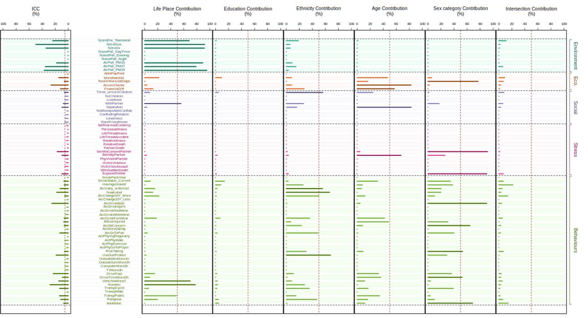

# Mining the intersectional structure of a population

Using a fonction, we can applied this analysis in several exposures or health outcomes. For exemple, in our population, we estimate the ICC of strata (48) for several environmental, economic, social, stress exposures and behaviours; and the contribution of each category and intersectional effect when the ICC was above 5%. 

