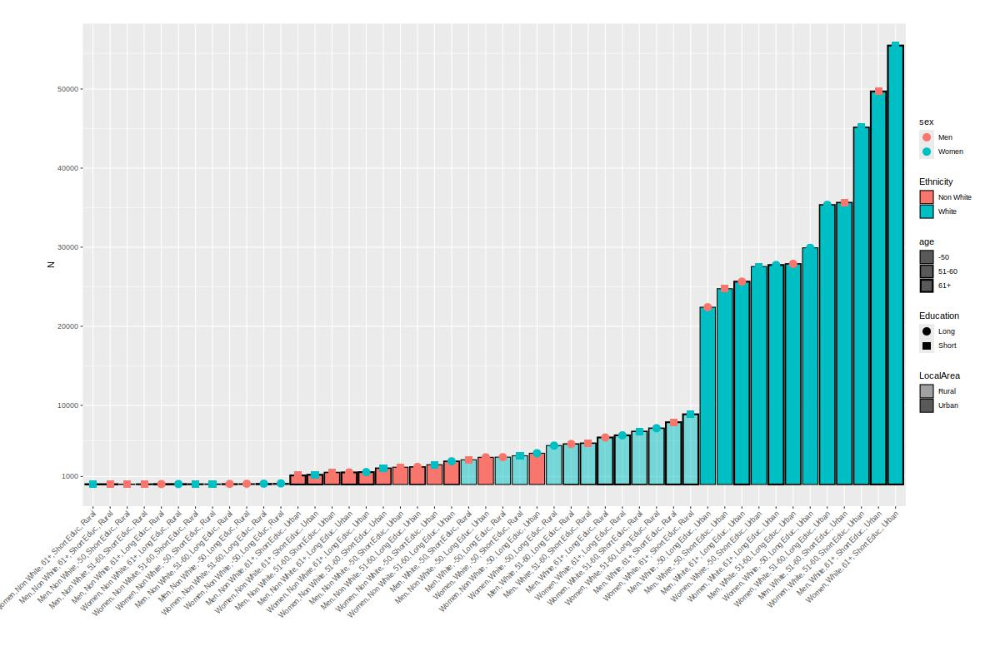
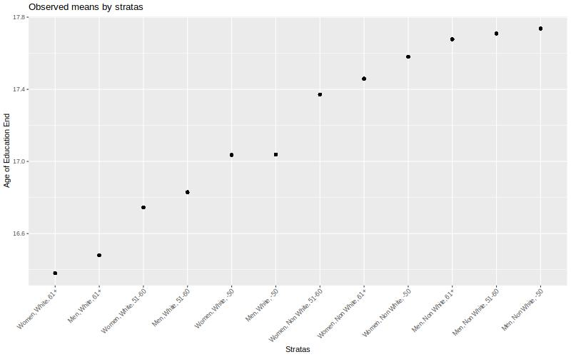
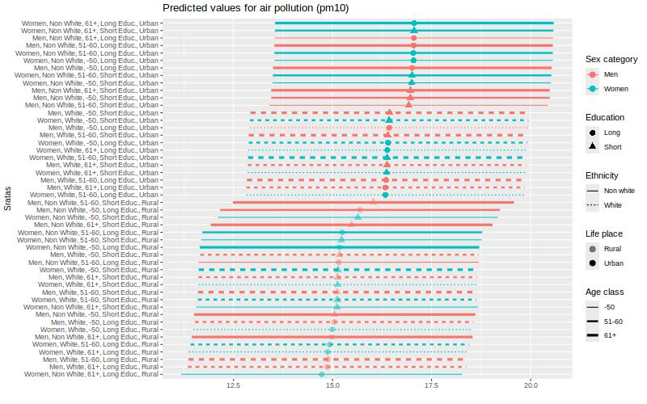

--- 
title: "MAIDHA | Very detailed examples"
author: "H. Colineaux"
date: "Last compiled on `r format(Sys.time(), '%d %B, %Y')`"
documentclass: book
bibliography: book.bib
site: bookdown::bookdown_site
always_allow_html: true
# cover-image: path to the social sharing image like images/cover.jpg
description: |
  This is a very detailed example of using the MAIDHA approach to describe
  intersectional phenomenon in biology and health.
---

# About

Disclaimer: Here, I'm not going back over the theory and concepts involved in intersectional quantative analysis and MAIDHA models. This is simply a sharing of scripts to simplify the implementation of this type of analysis in epidemiology.

We were largely inspired by the work of Evans et al (for example: @evans2024tutorial) and the vignette in the [ggeffects]:https://strengejacke.github.io/ggeffects/articles/practical_intersectionality.html package.

[Licence]:https://creativecommons.org/licenses/by-nc-sa/4.0/

{width=10%}

The online version of this book is licensed under the [Creative Commons Attribution-NonCommercial-ShareAlike 4.0 International License][Licence]. 


<!--chapter:end:index.Rmd-->

# Create stratas 

```{r load_data, message=FALSE, warning=FALSE, include=FALSE}

rm(list = ls())
graphics.off()
set.seed(25032024)

library(tidyverse)
library(ggeffects)   # predictions and significance testing
library(insight)     # extracting random effects variances
library(datawizard)  # data wrangling and preparation
library(parameters)  # model summaries
library(performance) # model fit indices, ICC
library(glmmTMB)     # multilevel modelling
library(sjPlot)

full_data <- readRDS("../../data/alldata2_toplay")

mydata <- full_data %>% select(
  Age = Demo_Age_Num,
  Sex = Demo_Sex_Bin_Men,
  Ethnicity = Demo_Ethnic_Bin_White,
  AgeEducEnd = SocioEco_Educ_AgeEnd_Num,
  Urban = Env_RuralOrUrban_Urban,
  AirPoll_PM10 = Env_AirPoll_PM10_ugm3,
  AlcDaily = Behav_Alc_Frequency_4Cat_3.Daily_orAlmost)

rm(full_data)

```

## Choose variables

For the first example, we use real data from the UKBB.

This is an exploratory and not a confirmatory analysis, the results are purely didactic and cannot be really interpreted. In particular, for simplicity, a simple imputation of missing data (KNN) has been carried out, which may affect the results.

### A first simple exemple (12 strata)
To define strata, we choose the following variables: 

- age, by classes: "-50", "51-60", "61+"
- declared binary sex category: men or women, 
- ethnicity: white or non-white. 

Outcomes will be later intersectional categories, i.e. 

- age at the end of education (quantitative variables) 
- life place: urban or rural (qualitative variable).

There are no variables characterizing socio-economic position at the start of life in this dataset, such as parent social class or income. 

### A second exemple (48 strata)

In a second step, we use to define intersectional strata:

- age, by classes: "-50", "51-60", "61+"
- declared binary sex category: men or women, 
- ethnicity: white or non-white. 
- education: end at 16 or before, end at 17 or after
- life place: urban or rural

The outcomes were: 

- drinking alcohol daily (binary outcomes)
- exposition to air pollution (pm10, ugm3).


## Definition and description

```{r labels}
mydata$Sex <- factor(round(mydata$Sex),
                           labels = c("Women","Men"))

mydata$Ethnicity <- factor(round(mydata$Ethnicity),
                           label = c("Non White","White"))

mydata <- mydata %>% 
  # recode age into three groups
  mutate(Age_class = round(Age)) %>% 
  recode_values(
    select = "Age_class",
    recode = list(`1` = "min:50", `2` = 51:60, `3` = "61:max")) %>% 
  mutate(Age_class = factor(Age_class, labels = c("-50", "51-60", "61+")))

mydata$Qualification <- factor(round(mydata$Qualification),
                               labels = c("Med-High Qualif.", "Low Qualif."))

mydata$Urban <- factor(round(mydata$Urban),
                       labels = c("Rural", "Urban"))

mydata <- mydata %>% 
  # recode age into three groups
  mutate(Education = round(AgeEducEnd)) %>% 
  recode_values(
    select = "Education",
    recode = list(`0` = "min:16", `1` = "17:max")) %>% 
  mutate(Education = factor(Education, labels = c("Short Educ.", "Long Educ.")))

table1::table1(~ Sex + Age + Ethnicity + AgeEducEnd + Education + Urban + AlcDaily + AirPoll_PM10,
       data=mydata,
    overall=c(left="Total"),
    caption="Description")

```

## Create strata variables

### For the first exemple (12 strata)

To create the stratas, I use the method describe in the vignette in the [ggeffects]:https://strengejacke.github.io/ggeffects/articles/practical_intersectionality.html package.

This involves concatenating the labels of the different variables. 

Remember to name the variable in the label, for example Ethnicity[White;Non White] rather than White[Yes;No].

```{r strata_1}
mydata$strata <- ifelse(
  is.na(mydata$Sex) | is.na(mydata$Ethnicity) | is.na(mydata$Age_class),
  NA_character_,
  paste0(mydata$Sex, ", ", mydata$Ethnicity, ", ", mydata$Age_class)
)

mydata$strata <- factor(mydata$strata)
```

We have 12 stratas

```{r descr_strata_1}

# data_tabulate(mydata$strata)

table1::table1(~ strata,
       data=mydata,
    overall=c(left="Total"),
    caption="Stratas (12)")

```

### For the second exemple (48 strata)

And with more categories:

```{r strata_2 }
mydata$strata_2 <- ifelse(
  is.na(mydata$Sex) | is.na(mydata$Ethnicity) | 
    is.na(mydata$Age_class) | is.na(mydata$Education) | is.na(mydata$Urban),
  NA_character_,
  paste0(mydata$Sex, ", ", mydata$Ethnicity, ", ",
         mydata$Age_class,", ", mydata$Education,", ", mydata$Urban)
)
```

We have 48 stratas

```{r descr_strata_2}

mydata$strata_2 <- factor(mydata$strata_2)

table1::table1(~ strata_2,
       data=mydata,
    overall=c(left="Total"),
    caption="Stratas (48)")

```

In this case, some stratas are very small.

```{r sizr_1, message=FALSE, warning=FALSE}
tab <- data_tabulate(mydata$strata_2)
tab <- tab[1:48,]
min(tab$N)
max(tab$N)

```

## Plots the stratas distribution

### For the first exemple

```{r plot_stata_1, message=FALSE, warning=FALSE}

df <- data.frame(x = names(table(mydata$strata)),
                 p = as.numeric(table(mydata$strata))/length(mydata$strata),
                 n = as.numeric(table(mydata$strata)))

df$sex = as.factor(ifelse(grepl("Men", df$x), "Men", "Women"))
df$ethnicity <- as.factor(ifelse(grepl("Non White", df$x), "Non White", "White"))
df$age <- as.factor(ifelse(grepl("61+", df$x), "61+",
                           ifelse(grepl("-50", df$x), "-50","51-60")))

jpeg("img/plot_stata_1.jpeg",
         width = 800, height = "500")
ggplot(data = df) + 
  geom_col(aes(x = fct_reorder(x,n,.fun='median'), y = n,
               linewidth = age,  fill = ethnicity), color = "black") +
  geom_point(aes(x = fct_reorder(x,n,.fun='median'), y = n,
                 color = sex), size =4) +
  theme(plot.margin = margin(1,1,1.5,2, "cm"))+ 
  labs (x="", y = "N",
        fill = "Ethnicity") +
  theme(axis.text.x = element_text(angle = 45,  vjust=1,  hjust=1))+
  scale_linewidth_discrete(range = c(0.5, 1))+
  # scale_y_log10()
  scale_y_continuous(breaks = c(1000, 10000, 25000,50000, 75000))+
  scale_shape_manual(values=c(19, 15))
dev.off()


```


### For the second exemple

```{r stata_2, fig.asp = 0.8, fig.width = 10, message=FALSE, warning=FALSE}

df_2 <- data.frame(x = names(table(mydata$strata_2)),
                 p = as.numeric(table(mydata$strata_2))/length(mydata$strata_2),
                 n = as.numeric(table(mydata$strata_2)))
df_2$sex = as.factor(ifelse(grepl("Men", df_2$x), "Men", "Women"))
df_2$ethnicity <- as.factor(ifelse(grepl("Non White", df_2$x), "Non White", "White"))
df_2$age <- as.factor(ifelse(grepl("61+", df_2$x), "61+",
                           ifelse(grepl("-50", df_2$x), "-50","51-60")))
df_2$Education <- as.factor(ifelse(grepl("Short", df_2$x), "Short", "Long"))
df_2$LocalArea <- as.factor(ifelse(grepl("Urban", df_2$x), "Urban", "Rural"))

jpeg("img/plot_stata_2.jpeg",
         width = 1200, height = "800")
ggplot(data = df_2) + 
  geom_col(aes(x = fct_reorder(x,n,.fun='median'), y = n,
               linewidth = age,  fill = ethnicity, alpha = LocalArea), color = "black") +
  geom_point(aes(x = fct_reorder(x,n,.fun='median'), y = n,
                 shape = Education,  color = sex), size =4) +
  theme(plot.margin = margin(1,1,1.5,2, "cm"))+ 
  labs (x="", y = "N",
        fill = "Ethnicity") +
  theme(axis.text.x = element_text(angle = 45,  vjust=1,  hjust=1))+
  scale_alpha_discrete(range = c(0.5, 1))+
  scale_linewidth_discrete(range = c(0.5, 1))+
  # scale_y_log10()
  scale_y_continuous(breaks = c(1000, 10000, 20000,30000,40000,50000))+
  scale_shape_manual(values=c(19, 15))

dev.off()


```



<!--chapter:end:01-intro.Rmd-->

# Simple example - binary outcome

As a working example, we want to explore intersectional inequalities in life place (a "late" intersectional strata) by early intersectional strata (12 stratas).


## Description

We can start by describe the outcome by strata.

```{r message=FALSE, warning=FALSE}

table1::table1(~ Sex + Age_class + Ethnicity | Urban,
       data=mydata,
    overall=c(left="Total"),
    caption="Description by life place")

```

We can plot the observed probability.

```{r plot_12_quali}
jpeg("img/plot_12_quali.jpeg",
         width = 1200, height = "800")
mydata %>% 
  group_by(strata) %>% 
  mutate(tot = n()) %>% ungroup() %>% 
  group_by(strata,Urban) %>% 
  mutate(value = n()/tot) %>% 
  filter(Urban == "Urban") %>% 
  ggplot(aes(x = fct_reorder(strata,value,.fun='median'),
             y =value)) +
    geom_point()  +
    labs(x = "Stratas", y = "Living in an Urban area",
         title = "Observed percentage by stratas") +
  theme(axis.text.x = element_text(angle = 45,  vjust=1,  hjust=1))
dev.off()

```


## The null model (only strata) 

The null model allows us to estimate the IntraClass correlation (ICC), also known as the Variance Partition Coefficient (VPC), that is the part of the outcome variance that can be explained by the strata.


```{r models_1,  message=FALSE, warning=FALSE}

# multilevel model
m_null <- glmmTMB(Urban ~ 1 + (1 | strata),
                  data = mydata,
                  family = binomial)

# intercept varies according to the stratum
jpeg("img/models_1.jpeg",
         width = 1200, height = "800")
sjPlot::plot_model(m_null, type = "diag")
dev.off()


```


Outputs of the models: 

```{r output 1, message=FALSE, warning=FALSE}
summary(m_null)

# get the variances:
v_null <- get_variance(m_null)
# between stratas variance:
v_null$var.random
# intraclass correlation 
ICC_intersect <- round(icc(m_null)$ICC_unadjusted*100, 2)
ICC_intersect

```

Plot of the predicted values by strata:

```{r plot 1, message=FALSE, warning=FALSE}
#plot
predictions <- predict_response(
      m_null,
      c("strata"),
      type = "random") 
    predictions <- predictions %>% 
      arrange(predicted) 
    predictions$rown = rownames(predictions)
    predictions$x_lab <- paste0(predictions$rown,".",predictions$x)
    predictions$sex <- as.factor(ifelse(grepl("Men", predictions$x), "Men", "Women"))
    predictions$ethnicity <- as.factor(ifelse(grepl("Non White", predictions$x), "Non white", "White"))
    predictions$age <- as.factor(ifelse(grepl("61+", df$x), "61+",
                           ifelse(grepl("-50", df$x), "-50","51-60")))
    jpeg("img/plot.jpeg",
         width = 1200, height = "800")
    print(predictions %>% 
            ggplot(aes(x=predicted, y=fct_reorder(x,predicted,.fun='median'),
                       color = sex, linetype = ethnicity))+
            geom_point(size=3) +
            geom_linerange(aes(xmin = conf.low, xmax = conf.high, size = age))+
            labs( y = "Sratas", 
                  x = "",
                  color = "Sex Category",
                  linetype = "Ethnicity",
                  size = "Age",
                  title = paste("Predicted values for having a low Urban"))+
            theme(axis.title = element_text(size = 10),
                  axis.text=element_text(size=10)))+ 
            scale_size_discrete(range = c(0.5, 1.5))
dev.off()

```


## The variance change 

To calculate the (additive) contribution of each category to the total variance, we can estimate the variance change when adjusting for this category. The Proportional Variance Change (PVC) when adjusting for all categories is the portion of ICC/VPC explained by additive effect. Therefore 100% - PVC is the part explained by an intersectional effect .


```{r outputs 2,  message=FALSE, warning=FALSE}

# models where we add each category one by one
m_gender <- glmmTMB(Urban ~ Sex + (1 | strata), data = mydata, family=binomial)
m_ethnicity <- glmmTMB(Urban ~ Ethnicity + (1 | strata), data = mydata, family=binomial)
m_age <- glmmTMB(Urban ~ Age_class + (1 | strata), data = mydata, family=binomial)
m_full <- glmmTMB(Urban ~ Age_class + Ethnicity + Sex + (1 | strata), data = mydata, family=binomial)

v_gender <- get_variance(m_gender)
v_ethnicity <- get_variance(m_ethnicity)
v_age <- get_variance(m_age)
v_full <- get_variance(m_full)

prop_gender <- round(((v_null$var.random - v_gender$var.random) / v_null$var.random)*100,2)
prop_gender <- ifelse(is.null(prop_gender), 0, prop_gender)

prop_ethnicity <- round(((v_null$var.random - v_ethnicity$var.random) / v_null$var.random)*100,2)
prop_ethnicity <- ifelse(is.null(prop_ethnicity), 0, prop_ethnicity)

prop_age <- round(((v_null$var.random - v_age$var.random) / v_null$var.random)*100,2)
prop_age <- ifelse(is.null(prop_age), 0, prop_age)

prop_full <- round(((v_null$var.random - v_full$var.random) / v_null$var.random)*100,2)
prop_full <- ifelse(is.null(prop_full), 100, prop_full)
prop_intersection <- round(100 - prop_full,2)


print(
  as.data.frame(
    cbind(
    parameters = c("ICC/VPC", "% Sex category", "% Age/generation", "% Ethnicity", "%Intersection"),
    values = c(ICC_intersect,prop_gender, prop_age, prop_ethnicity,prop_intersection )
  )))

```

ICC is `r ICC_intersect`%, which is low. This differences is mainly explained by ethnicity (`r prop_ethnicity`%), sex category  (`r prop_gender`%) and age (`r prop_age`%).


<!--chapter:end:02-multilevels_models.Rmd-->

# Simple example - continous outcome

As a working example, we want to explore intersectional inequalities in educaion length (a "late" intersectional strata) by early intersectional strata (12 stratas).

## Description

```{r, message=FALSE, warning=FALSE}

table1::table1(~ Sex + Age_class + Ethnicity | Education,
       data=mydata,
    overall=c(left="Total"),
    caption="Description by age of education end")

```

We can plot the observed means by strata.

```{r plot_12_quanti}
jpeg("img/plot_12_quanti.jpeg",
         width = 1200, height = "800")
mydata %>% 
  group_by(strata) %>% 
  mutate(value = mean(AgeEducEnd)) %>% 
  ggplot(aes(x = fct_reorder(strata,value,.fun='median'),
             y =value)) +
    geom_point()  +
    labs(x = "Stratas", y = "Age of Education End",
         title = "Observed means by stratas") +
  theme(axis.text.x = element_text(angle = 45,  vjust=1,  hjust=1))
dev.off()


```



## The null model (only strata) 

The null model allows us to estimate the IntraClass correlation (ICC), also known as the Variance Partition Coefficient (VPC), that is the part of the outcome variance that can be explained by the strata.


```{r models_1_quanti,  message=FALSE, warning=FALSE}

# multilevel model
m_null <- glmmTMB(AgeEducEnd ~ 1 + (1 | strata),
                  data = mydata)


```

Outputs of the models: 

```{r output_1_quanti, message=FALSE, warning=FALSE}
summary(m_null)

# get the variances:
v_null <- get_variance(m_null)
# between stratas variance:
v_null$var.random
# intraclass correlation 
ICC_intersect <- round(icc(m_null)$ICC_unadjusted*100, 2)
ICC_intersect

```

Plot of the predicted values by strata:

```{r plot_1_quanti, message=FALSE, warning=FALSE}
#plot
predictions <- predict_response(
      m_null,
      c("strata"),
      type = "random") 
    predictions <- predictions %>% 
      arrange(predicted) 
    predictions$rown = rownames(predictions)
    predictions$x_lab <- paste0(predictions$rown,".",predictions$x)
    predictions$sex <- as.factor(ifelse(grepl("Men", predictions$x), "Men", "Women"))
    predictions$ethnicity <- as.factor(ifelse(grepl("Non White", predictions$x), "Non white", "White"))
    predictions$age <- as.factor(ifelse(grepl("61+", df$x), "61+",
                           ifelse(grepl("-50", df$x), "-50","51-60")))
    jpeg("img/plot_quanti.jpeg",
         width = 1200, height = "800")
    print(predictions %>% 
            ggplot(aes(x=predicted, y=fct_reorder(x,predicted,.fun='median'),
                       color = sex, linetype = ethnicity))+
            geom_point(size=3) +
            geom_linerange(aes(xmin = conf.low, xmax = conf.high, size = age))+
            labs( y = "Sratas", 
                  x = "",
                  color = "Sex Category",
                  linetype = "Ethnicity",
                  size = "Age",
                  title = paste("Predicted values for Age of Education End"))+
            theme(axis.title = element_text(size = 10),
                  axis.text=element_text(size=10)))+ 
            scale_size_discrete(range = c(0.5, 1.5))
dev.off()

```


## The variance change 

To calculate the (additive) contribution of each category to the total variance, we can estimate the variance change when adjusting for this category. The Proportional Variance Change (PVC) when adjusting for all categories is the portion of ICC/VPC explained by additive effect. Therefore 100% - PVC is the part explained by an intersectional effect .


```{r outputs_2_quanti,  message=FALSE, warning=FALSE}

# models where we add each category one by one
m_gender <- glmmTMB(AgeEducEnd ~ Sex + (1 | strata), data = mydata)
m_ethnicity <- glmmTMB(AgeEducEnd ~ Ethnicity + (1 | strata), data = mydata)
m_age <- glmmTMB(AgeEducEnd ~ Age_class + (1 | strata), data = mydata)
m_full <- glmmTMB(AgeEducEnd ~ Age_class + Ethnicity + Sex + (1 | strata), data = mydata)

v_gender <- get_variance(m_gender)
v_ethnicity <- get_variance(m_ethnicity)
v_age <- get_variance(m_age)
v_full <- get_variance(m_full)

prop_gender <- round(((v_null$var.random - v_gender$var.random) / v_null$var.random)*100,2)
prop_gender <- ifelse(is.null(prop_gender), 0, prop_gender)

prop_ethnicity <- round(((v_null$var.random - v_ethnicity$var.random) / v_null$var.random)*100,2)
prop_ethnicity <- ifelse(is.null(prop_ethnicity), 0, prop_ethnicity)

prop_age <- round(((v_null$var.random - v_age$var.random) / v_null$var.random)*100,2)
prop_age <- ifelse(is.null(prop_age), 0, prop_age)

prop_full <- round(((v_null$var.random - v_full$var.random) / v_null$var.random)*100,2)
prop_full <- ifelse(is.null(prop_full), 100, prop_full)
prop_intersection <- round(100 - prop_full,2)


print(
  as.data.frame(
    cbind(
    parameters = c("ICC/VPC", "% Sex category", "% Age/generation", "% Ethnicity", "%Intersection"),
    values = c(ICC_intersect,prop_gender, prop_age, prop_ethnicity,prop_intersection )
  )))

```

ICC is `r ICC_intersect`%, which is moderate. This differences is mainly explained by ethnicity (`r prop_ethnicity`%), age (`r prop_age`%) and an intersectional effect  (`r prop_intersection`%).


<!--chapter:end:03-multilevels_models_2.Rmd-->

# More complexe example - binary outcome

As a working example, we want to explore intersectional inequalities in exposition to air pollution (pm 10) by  intersectional strata (48 stratas).

## Description

We can start by describe the outcome by strata.

```{r message=FALSE, warning=FALSE}

table1::table1(~ Sex + Age_class + Ethnicity +
                 Education + Urban | AlcDaily,
       data=mydata,
    overall=c(left="Total"),
    caption="Description by Alcohol consumption")

```

We can plot the observed probability.

```{r plot_12_quali_2}
jpeg("img/plot_12_quali_2.jpeg",
         width = 1200, height = "800")
mydata %>% 
  group_by(strata_2) %>% 
  mutate(tot = n()) %>% ungroup() %>% 
  group_by(strata_2,AlcDaily) %>% 
  mutate(value = n()/tot) %>% 
  filter(AlcDaily == "Yes") %>% 
  ggplot(aes(x = fct_reorder(strata_2,value,.fun='median'),
             y =value)) +
    geom_point()  +
    labs(x = "Stratas", y = "Daily alcohol consumption",
         title = "Observed percentage by stratas") +
  theme(axis.text.x = element_text(angle = 45,  vjust=1,  hjust=1))
dev.off()

```


## The null model (only strata) 

The null model allows us to estimate the IntraClass correlation (ICC), also known as the Variance Partition Coefficient (VPC), that is the part of the outcome variance that can be explained by the strata.


```{r models_1_2,  message=FALSE, warning=FALSE}

# multilevel model
m_null <- glmmTMB(AlcDaily ~ 1 + (1 | strata_2),
                  data = mydata,
                  family = binomial)

# intercept varies according to the stratum
jpeg("img/models_1_2.jpeg",
         width = 1200, height = "800")
sjPlot::plot_model(m_null, type = "diag")
dev.off()


```


Outputs of the models: 

```{r output 1_2, message=FALSE, warning=FALSE}
summary(m_null)

# get the variances:
v_null <- get_variance(m_null)
# between stratas variance:
v_null$var.random
# intraclass correlation 
ICC_intersect <- round(icc(m_null)$ICC_unadjusted*100, 2)
ICC_intersect

```

Plot of the predicted values by strata:

```{r plot_1_2, message=FALSE, warning=FALSE}
#plot
predictions <- predict_response(
      m_null,
      c("strata_2"),
      type = "random") 
    predictions <- predictions %>% 
      arrange(predicted) 
    predictions$rown = rownames(predictions)
    predictions$x_lab <- paste0(predictions$rown,".",predictions$x)
    predictions$sex <- as.factor(ifelse(grepl("Men", predictions$x), "Men", "Women"))
    predictions$ethnicity <- as.factor(ifelse(grepl("Non White", predictions$x), "Non white", "White"))
    predictions$age <- as.factor(ifelse(grepl("61+", df$x), "61+",
                           ifelse(grepl("-50", df$x), "-50","51-60")))
    predictions$Education <- as.factor(ifelse(grepl("Short", predictions$x), "Short", "Long"))
    predictions$localarea <- as.factor(ifelse(grepl("Urban", predictions$x), "Urban", "Rural"))
    jpeg("img/plot_2.jpeg",
         width = 1200, height = "800")
    print(predictions %>% 
            ggplot(aes(x=predicted, y=fct_reorder(x,predicted,.fun='median'), 
                       color = sex, linetype = ethnicity))+
            geom_point(aes(shape = Education, alpha = localarea),size=3) +
            geom_linerange(aes(xmin = conf.low, xmax = conf.high, size = age)) +
            labs(y = "Sratas",
                 x = "",
                 shape = "Education",
                 alpha = "Life place",
                 size = "Age class",
                 color = "Sex category",
                 linetype = "Ethnicity",
                 title = "Predicted values for daily alcohol consumption") +
            theme(axis.title = element_text(size = 10)) + 
            scale_size_discrete(range = c(0.5, 1.5)) +
            scale_alpha_discrete(range = c(0.5, 1)))
dev.off()

```


## The variance change 

To calculate the (additive) contribution of each category to the total variance, we can estimate the variance change when adjusting for this category. The Proportional Variance Change (PVC) when adjusting for all categories is the portion of ICC/VPC explained by additive effect. Therefore 100% - PVC is the part explained by an intersectional effect .


```{r outputs_2_2,  message=FALSE, warning=FALSE}

# models where we add each category one by one
m_gender <- glmmTMB(AlcDaily ~ Sex + (1 | strata_2),
                    data = mydata, family=binomial)
m_ethnicity <- glmmTMB(AlcDaily ~ Ethnicity + (1 | strata_2),
                       data = mydata, family=binomial)
m_age <- glmmTMB(AlcDaily ~ Age_class + (1 | strata_2),
                 data = mydata, family=binomial)
m_urban <- glmmTMB(AlcDaily ~ Urban + (1 | strata_2),
                       data = mydata, family=binomial)
m_qualif <- glmmTMB(AlcDaily ~ Education + (1 | strata_2),
                 data = mydata, family=binomial)
m_full <- glmmTMB(AlcDaily ~ Age_class + Ethnicity + Sex +
                    Urban + Education +  (1 | strata_2),
                  data = mydata, family=binomial)

v_gender <- get_variance(m_gender)
v_ethnicity <- get_variance(m_ethnicity)
v_age <- get_variance(m_age)
v_urban <- get_variance(m_urban)
v_qualif <- get_variance(m_qualif)
v_full <- get_variance(m_full)

prop_gender <- round(((v_null$var.random - v_gender$var.random) / v_null$var.random)*100,2)
prop_gender <- ifelse(is.null(prop_gender), 0, prop_gender)

prop_ethnicity <- round(((v_null$var.random - v_ethnicity$var.random) / v_null$var.random)*100,2)
prop_ethnicity <- ifelse(is.null(prop_ethnicity), 0, prop_ethnicity)

prop_age <- round(((v_null$var.random - v_age$var.random) / v_null$var.random)*100,2)
prop_age <- ifelse(is.null(prop_age), 0, prop_age)

prop_qualif <- round(((v_null$var.random - v_qualif$var.random) / v_null$var.random)*100,2)
prop_qualif <- ifelse(is.null(prop_qualif), 0, prop_qualif)

prop_urban <- round(((v_null$var.random - v_urban$var.random) / v_null$var.random)*100,2)
prop_urban <- ifelse(is.null(prop_urban), 0, prop_urban)

prop_full <- round(((v_null$var.random - v_full$var.random) / v_null$var.random)*100,2)
prop_full <- ifelse(is.null(prop_full), 100, prop_full)
prop_intersection <- round(100 - prop_full,2)


print(
  as.data.frame(
    cbind(
    parameters = c("ICC/VPC", "% Sex category", "% Age/generation",
                   "% Ethnicity", "% Life Place", "% Education",
                   "%Intersection"),
    values = c(ICC_intersect,prop_gender, prop_age, prop_ethnicity,
               prop_urban,prop_qualif, prop_intersection )
  )))

```

ICC is `r ICC_intersect`%, which is low. This differences is mainly explained by ethnicity (`r prop_ethnicity`%), sex category (`r prop_gender`%) and life place (`r prop_urban`%).


<!--chapter:end:04-multilevels_models_3.Rmd-->

# More complexe example - quantitative outcome

As a working example, we want to explore intersectional inequalities in loneliness by  intersectional strata (48 stratas).

## Description

We can start by describe the outcome by strata.

```{r message=FALSE, warning=FALSE}
mydata$AirPoll_PM10d_class <- as.factor(ifelse(mydata$AirPoll_PM10 < mean(mydata$AirPoll_PM10),
                                                                     "Below mean", "Above mean"))

table1::table1(~ Sex + Age_class + Ethnicity +
                 Education + Urban | AirPoll_PM10d_class,
       data=mydata,
    overall=c(left="Total"),
    caption="Description by air pollution")

```

We can plot the observed means by strata.

```{r plot_12_quanti_2}
jpeg("img/plot_12_quanti_2.jpeg",
         width = 1200, height = "800")
mydata %>% 
  group_by(strata_2) %>% 
  mutate(value = mean(AirPoll_PM10)) %>% 
  ggplot(aes(x = fct_reorder(strata_2,value,.fun='median'),
             y =value)) +
    geom_point()  +
    labs(x = "Stratas", y = "Air pollution (pm 10)",
         title = "Observed means by stratas") +
  theme(axis.text.x = element_text(angle = 45,  vjust=1,  hjust=1))
dev.off()

```


## The null model (only strata) 

The null model allows us to estimate the IntraClass correlation (ICC), also known as the Variance Partition Coefficient (VPC), that is the part of the outcome variance that can be explained by the strata.


```{r models_1_quanti_2,  message=FALSE, warning=FALSE}

# multilevel model
m_null <- glmmTMB(AirPoll_PM10 ~ 1 + (1 | strata_2),
                  data = mydata)

```

Outputs of the models: 

```{r output_1_quanti_2, message=FALSE, warning=FALSE}
summary(m_null)

# get the variances:
v_null <- get_variance(m_null)
# between stratas variance:
v_null$var.random
# intraclass correlation 
ICC_intersect <- round(icc(m_null)$ICC_unadjusted*100, 2)
ICC_intersect

```

Plot of the predicted values by strata:

```{r plot_1_quanti_2, message=FALSE, warning=FALSE}
#plot
predictions <- predict_response(
      m_null,
      c("strata_2"),
      type = "random") 
    predictions <- predictions %>% 
      arrange(predicted) 
    predictions$rown = rownames(predictions)
    predictions$x_lab <- paste0(predictions$rown,".",predictions$x)
    predictions$sex <- as.factor(ifelse(grepl("Men", predictions$x), "Men", "Women"))
    predictions$ethnicity <- as.factor(ifelse(grepl("Non White", predictions$x), "Non white", "White"))
    predictions$age <- as.factor(ifelse(grepl("61+", df$x), "61+",
                           ifelse(grepl("-50", df$x), "-50","51-60")))
    predictions$Education <- as.factor(ifelse(grepl("Short", predictions$x), "Short", "Long"))
    predictions$localarea <- as.factor(ifelse(grepl("Urban", predictions$x), "Urban", "Rural"))
    jpeg("img/plot_quanti_2.jpeg",
         width = 1200, height = "800")
    print(predictions %>% 
            ggplot(aes(x=predicted, y=fct_reorder(x,predicted,.fun='median'), 
                       color = sex, linetype = ethnicity))+
            geom_point(aes(shape = Education, alpha = localarea),size=3) +
            geom_linerange(aes(xmin = conf.low, xmax = conf.high, size = age)) +
            labs(y = "Sratas",
                 x = "",
                 shape = "Education",
                 alpha = "Life place",
                 size = "Age class",
                 color = "Sex category",
                 linetype = "Ethnicity",
                 title = "Predicted values for air pollution (pm10)") +
            theme(axis.title = element_text(size = 10)) + 
            scale_size_discrete(range = c(0.5, 1.5)) +
            scale_alpha_discrete(range = c(0.5, 1)))
dev.off()

```



## The variance change 

To calculate the (additive) contribution of each category to the total variance, we can estimate the variance change when adjusting for this category. The Proportional Variance Change (PVC) when adjusting for all categories is the portion of ICC/VPC explained by additive effect. Therefore 100% - PVC is the part explained by an intersectional effect .


```{r outputs_2_quanti_2,  message=FALSE, warning=FALSE}

# models where we add each category one by one
m_gender <- glmmTMB(AirPoll_PM10 ~ Sex + (1 | strata_2),
                    data = mydata)
m_ethnicity <- glmmTMB(Loneliness ~ Ethnicity + (1 | strata_2),
                       data = mydata)
m_age <- glmmTMB(AirPoll_PM10 ~ Age_class + (1 | strata_2),
                 data = mydata)
m_urban <- glmmTMB(AirPoll_PM10 ~ Urban + (1 | strata_2),
                       data = mydata)
m_qualif <- glmmTMB(AirPoll_PM10 ~ Education + (1 | strata_2),
                 data = mydata)
m_full <- glmmTMB(AirPoll_PM10 ~ Age_class + Ethnicity + Sex +
                    Urban + Education +  (1 | strata_2),
                  data = mydata)

v_gender <- get_variance(m_gender)
v_ethnicity <- get_variance(m_ethnicity)
v_age <- get_variance(m_age)
v_urban <- get_variance(m_urban)
v_qualif <- get_variance(m_qualif)
v_full <- get_variance(m_full)

prop_gender <- round(((v_null$var.random - v_gender$var.random) / v_null$var.random)*100,2)
prop_gender <- ifelse(is.null(prop_gender), 0, prop_gender)

prop_ethnicity <- round(((v_null$var.random - v_ethnicity$var.random) / v_null$var.random)*100,2)
prop_ethnicity <- ifelse(is.null(prop_ethnicity), 0, prop_ethnicity)

prop_age <- round(((v_null$var.random - v_age$var.random) / v_null$var.random)*100,2)
prop_age <- ifelse(is.null(prop_age), 0, prop_age)

prop_qualif <- round(((v_null$var.random - v_qualif$var.random) / v_null$var.random)*100,2)
prop_qualif <- ifelse(is.null(prop_qualif), 0, prop_qualif)

prop_urban <- round(((v_null$var.random - v_urban$var.random) / v_null$var.random)*100,2)
prop_urban <- ifelse(is.null(prop_urban), 0, prop_urban)

prop_full <- round(((v_null$var.random - v_full$var.random) / v_null$var.random)*100,2)
prop_full <- ifelse(is.null(prop_full), 100, prop_full)
prop_intersection <- round(100 - prop_full,2)


print(
  as.data.frame(
    cbind(
    parameters = c("ICC/VPC", "% Sex category", "% Age/generation",
                   "% Ethnicity", "% Life Place", "% Education",
                   "%Intersection"),
    values = c(ICC_intersect,prop_gender, prop_age, prop_ethnicity,
               prop_urban,prop_qualif, prop_intersection )
  )))

```

ICC is `r ICC_intersect`%, which is low. This differences is mainly explained by ethnicity (`r prop_ethnicity`%), life place (`r prop_urban`%) and sex category (`r prop_gender`%).


<!--chapter:end:05-multilevels_models_4.Rmd-->

`r if (knitr::is_html_output()) '
# References {-}
'`

<!--chapter:end:07-references.Rmd-->

